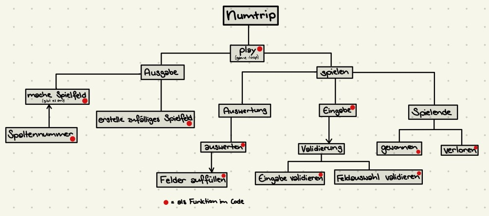

## **Finaler Blogbeitrag Numtrip**

### Ziel des Spiels:

Man soll ein Spielfeld mit (quadratischen) Felder mit jeweils einer Zahl haben, welches ausgegeben werden kann und für den Benutzer sichtbar ist. Der Benutzer wählt nun ein Feld seiner Wahl (solange es einen gleichwertigen Nachbar hat). Dieses Feld und alle gleichwertigen Nachbaren werden nun gelöscht und an der Stelle des ausgewählten Feldes steht nun der doppelte Wert des vorherigen Werts. Dann fallen alle nach unten (schliessen auf) falls unter ihnen noch ein leeres Feld ist und der Rest des Spielfelds wird mit zufälligen Zahlen aufgefüllt.
!!!Im Spiel kommen als Zahlen nur Zweierpotenzen vor(bei mir ohne 1). Das Ziel besteht dann darin, 256 zu erreichen in einem Feld, ohne vorher zu verlieren. Verlieren tut man, wenn man kein Feld mehr mit gleichwertigen Nachbaren hat.

Ein weiteres Ziel für uns war auch, dass wir die gelernten Grundlagen nicht nur theoretisch beherrschen, sondern auch praktisch und verbunden miteinander.

## Umsetzung des Spiels:

- Voraussetzung: Man sollte Python 3.10.6 installiert haben. Man sollte zudem ein Programm heruntergeladen haben, welches Code ausführen kann.

### Top-down-Entwurf mit meinen Funktionen:



### Der Flood-fill-Algorythmus:

Ich habe mich dafür entschieden, den Flood-fill-Algorhythmus kurz zu erläutern, da ich mich bereits im Pythonrepetition mit rekursiven Funktionen beschäftigt haben.  
Das Prinzip von rekursiven Funktionen ist, dass sich die Funktion selbst aufruft. Dadurch ensteht eine (zugegeben ziemlich komplexe) Verschachtelung der Ausführungen, die in der Funktion getätigt werden. Zudem muss immer eine Abbruchbedingung formuliert werden, da sonst der Algorythmus unendlich lange weiterläuft.

- Das schwerste am Schreiben einer rekursiven Funktion ist wohl, dass man im Kopf versucht zu überlegen wann die Funktion sich selbst aufruft, damit die Verschachtelung an der richtigen Stelle geschieht.

Ich brauchte eine rekursive Funktion beim Löschen der Felder mit dem gleichen Wert. In der Funktion sollte geprüft werden, ob das anliegende Feld der gleiche Wert hat und wenn ja, ob das anliegende Feld dieses anliegenden Feldes auch den gleichen Wert hat. Um diese Überprüfung eben auch von den anliegenden Felder aus zu machen, muss sich die Funktion selbst aufrufen -> rekursive Funktion.
Mein Flood-fil-Algorythmus im Spiel sieht so aus (mit Rahmenbedingungen, damit es nicht ausserhalb des Feldes überprüft):

```py
def auswerten(x, y, vorherige_Zahl):
    # Rahmenbedingungen
    if x < 0 or x > 4:
        return False
    if y < 0 or y > 4:
        return False
    # Feldüberprüfen
    # im Spielfeld die richtige Liste (zeile), dann richtige Position in Liste (spalte)
    if spielfeld[x][y] == vorherige_Zahl:
        spielfeld[x][y] = 0
        auswerten(x, y + 1, vorherige_Zahl)  # rechts
        auswerten(x, y - 1, vorherige_Zahl)  # links
        auswerten(x + 1, y, vorherige_Zahl)  # unten
        auswerten(x - 1, y, vorherige_Zahl)  # oben
```

### Meine grössten Herausvorderungen:

Am meisten Mühe hatte ich mit der Funktion "felder_auffüllen()", in der die Felder "hinunterfallen", wenn unter ihnen ein leeres Feld ist. Dann sollte das Spielfeld zufällig aufgefüllt werden in allen Zellen, die noch leer sind.  
Ich hatte immer plötzlich nach etwa 20 Zügen ein leeres Feld und ich wusste nicht woher. Ich habe einfach gedacht, dass ich vergessen habe die restlichen Felder aufzufüllen und nur den Feldern, die ausgetauscht wurden einen neuen Wert zugwiesen haben. Jedoch habe ich nicht gemerkt, dass auch vorher beim "Herunterfallen" einen Fehler passiert ist. Hatte es nämlich z.B. zwei Zahlen oberhalb eines leeren Feldes, so habe ich die untere mit der leeren getauscht, jedoch dann eine Zufallszahl hingesetzt bevor die zweite Zahl auch noch "hinunterfallen" konnte.  
Eigentlich nur ein kleiner Fehler, der jedoch sehr lange unentdeckt blieb und mich verzweifeln liess.

```py
if spielfeld[zeile][zelle] == 0:
    zeilenindex = zeile
    while zeilenindex > 0 and spielfeld[zeilenindex][zelle] == 0:
        zeilenindex = zeilenindex - 1
    spielfeld[zeile][zelle] = spielfeld[zeilenindex][zelle]
    spielfeld[zeilenindex][zelle] = random.choice([2, 4, 8]) #-> FEHLER! Zuerst sollte da auf 0 gesetzt werden.
```

### Tipps für andere Schüler:

- Beginne immer bei 0 beim zählen!! Jedoch ist es für den Benutzer einfacher bei 1 zu beginnen. Also lasse den Benutzer beim Eingeben von Zahlen bei 1 starten, vergesse jedoch nicht, dann beim Auswerten der Eingabe die Zahl noch um eins zu verkleinern.
- Überprüfe, ob die Grenzen stimmen! Will ich x >= 0 oder nur x > 0 schreiben, dies macht einen Unterschied und kann den ganzen Code verändern. -> Auch da wieder: Man beginnt bei 0 mit zählen!
- Überlege dir vorher genau einen Plan (eventuell sogar mit Skizze) und kommentiere komplexe Funktionen oder Zeilen, damit du auch später noch verstehst, was gemacht wurde.
- Bleibe dran! Manchmal geht es ewigs, bis man einen Fehler findet oder bis etwas so funktioniert, wie man es will. Dies kann nervenraubend sein, aber du schaffst das!
