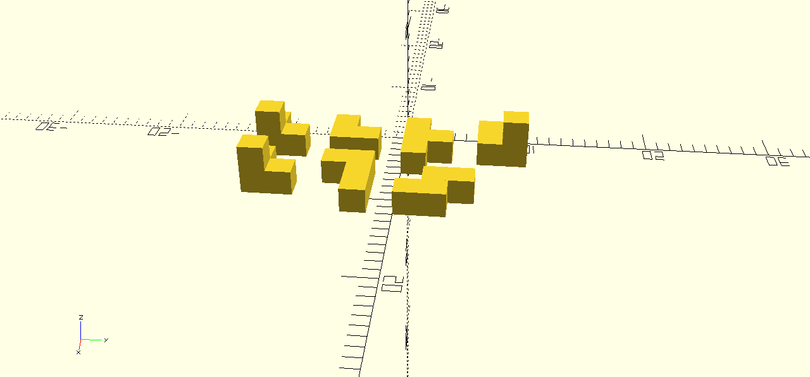

# Knobelwürfel



```scad
union() {
    cube ([6, 2, 2]);
    translate([2, 2, 0])
        cube([2, 2, 2]);
}

translate([0, -6, 0]) {
    union() {
        cube([4, 2, 2]);
        translate([2, 2, 0])
            cube([2, 2, 2]);
    }
}

translate([12, 0, 0]) {
    rotate([0, 0, 90])
    union() {
        cube([4, 2, 2]);
        translate([2, 2, 0])
            cube([4, 2, 2]);
    }
}

translate([6, -6, 0]) {
    union() {
        cube([2, 2, 2]);
        translate([0, 2, 0])
            cube([6, 2, 2]);
    }
}

translate([0, -12, 0]) {
    union() {
        cube([4, 2, 2]);
        translate([2, 2, 0])
            cube([2, 2, 2]);
        translate([2, 0, 2])
            cube([2, 2, 2]);
    }
}

translate([6, -12, 0]) {
    union() {
        cube([4, 2, 2]);
        translate([2, 2, 0])
            cube([2, 2, 2]);
        translate([2, 0, 2])
            cube([2, 2, 2]);
    }
}

translate([0, 6, 0]) {
    union() {
        cube([4, 2, 2]);
        translate([2, 2, 0])
            cube([2, 2, 2]);
        translate([2, 2, 2])
            cube([2, 2, 2]);
    }
}
```
