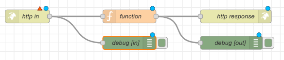

## Blogbeitrag - Erstellen einer API mit Node-Red

**Anleitung:**  
Zuerst musst du Node-Red öffnen und dort einen neuen Flow erstellen. In diesen Flow verbindest du dann ein `http in`-node über einen `function`-node mit einem `http response`-node. Jeweils am `http in`und am `http response` befestigst du noch einen `debug`-node. Dein Flow sollte nun so aussehen:
  
Zwei dieser Nodes sollten nun noch bearbeitet werden (die anderen kannst du wahlweise umbenennen). Beim `http in`-node solltest du mit Doppelklick auf den Node ein Fenster öffnen können, bei dem du die GET-Methode einstellen kannst und bei der URL den Endpunkt (Beim Beispiel mit dem Text, der in Emojis verwandelt wird, könnte dieser so lauten: `/api/to-emoji-lang`) eingeben kannst. Zum Schluss muss noch der `function`-node bearbeitet werden. Auch wieder durch Doppelklick öffnen und dann folgenden Code hineinschreiben/-kopieren.

```
let emoji = msg.payload.text;

emoji = emoji.replace(/hello/, '👋');

msg.payload = {
    msg: emoji
};

return msg;
```

Nach der zweiten Zeile kann die zweite Zeile noch beliebig oft wiederholt werden (einfach mit anderen Wörtern anstelle von "hello" und anderen Emojis anstelle von "👋" (auf Emojis zugreifen mit`windows`+ `punkt`)), um auch weitere Wörter in die Emojisprache umzuwandeln. Die zweite Zeile kann auch noch mit "gi" hinter dem "hello" (Bsp: emoji = emoji.replace(/hello/gi, '👋');) erweitert werden, damit die Gross- und Kleinschreibung vom Wort "hello" keine Rolle mehr spielt und man nicht jede Möglichkeit auflisten muss. Dann nur noch deployen und die Seite mit dem Endpunkt abfragen (Bsp von mir: https://node-red-22xa.onerender.com/api/to-emoji-lang) und den zu übersetzenden Text als Value des Keys `text` weitergeben (Achtung: Bei mir heisst der Key nicht `text` sondern `message` und muss folglich auch im Codeblock oben zu `msg.payload.message` geändert werden).
Voila, du hast gerade deine erste API erstellt! 🎉

**Erklärung:**  
Wie oben erwähnt, benutzen wir einen `http in`-node mit der Methode GET und einem Endpunkt. Die Methode GET sagt dir, dass die API auf eine Ressource zugreifen soll. Der Enpunkt verrät der API wo sie alle nötigen Informationen findet und ist der Pfad, dessen, auf das die API zugreifen soll. (In diesem Fall eben auf den Code, der sagt, wie ein Text umgeändert werden soll in Emojis vor dem zurückschicken)

Vielleicht hast du es schon erraten. Der `fuction`-node beinhaltet den Funktionscode, der die Anweisungen enthält wie der Text in Emojisprache umgewandelt werden kann. Die Funktion ist also der eigentlich wichtige Teil der API, wo das umwandeln geschieht.

Allgemein zum Ablauf kann man sagen, dass die API (durch die GET-Methode) auf eine Ressource zugreift, diese dann nach Angaben in der Funktion verändert und verändert zurückgibt.

Die angeschlossenen `Debug`-nodes sind dabei nur da, um fehlerhafte Inputs oder Outputs frühzeitig zu erkennen und einen Fehler zu verhindern.

**Erfahrung:**  
Zuerst wusste ich gar nicht richtig, dass das was wir gemacht haben eine API konstruieren ist. Erst als ich begonnen habe, diesen Blog zu schreiben und dafür die Aufgabe noch einmal durchgeschaut habe, ist mir aufgefallen, was die API ist - nämlich das Programm in Node-Red, welches wir gemacht haben, um Text in Emojisprache umzuwandeln. Schwer war es für mich nicht, diese API zu konstruieren und zu verstehen, nur habe ich den Zusammenhang zwischen der Aufgabe und der API-Konstruktion zuerst nicht gemacht.
