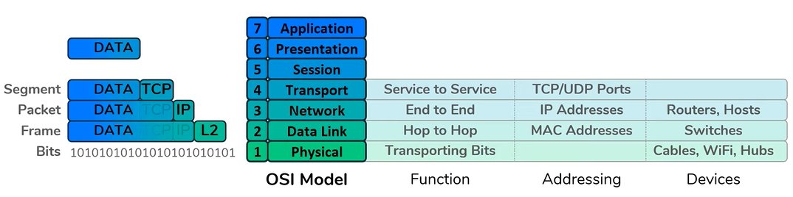
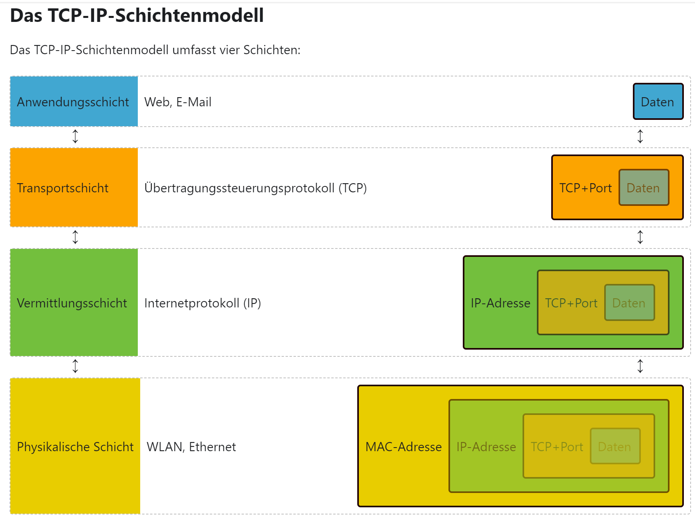
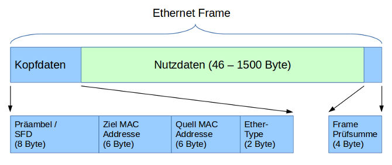

# Übersicht Netzwerke

## Vom LAN zum Internet

- **Host:** alle Geräte, welche Daten über ein Netzwerk erhalten oder verschicken können
- **Client:** senden Anfragen, verlangen etwas / **Servers**: antworten auf Anfragen, liefern etwas (Computer mit Programmen zum antworten spezifischer Anfragen); Rolle kann sich je nach Kommunikationsverhältnis ändern
- **IP-Adresse:** Identität eines Hosts und sind hierarschisch angeordnet (Networks, Subnetworks, Device)
- **Netzwerk:** transportiert die Daten, entsteht sobald mindestens zwei Hosts miteinander verbunden sind, es können auch Netzwerke in Netzwerken sein (Subnetworks), Im Internet sind viele Netzwerke (LANs) miteinander verbunden
- **LAN:** Local Area Network (Schulhausnetzwerk), **WAN:** Wide Area Network (Telefonnetzwerk)

Geräte in einem Netzwerk:
- **Repeater:** Signale verschwinden nach einer gewissen Distanz, ein Repeater gibt das Signal erneut aus (wiederholt es)
- **Hub:** multi-port repeater, repetiert Signale für alle angeschlossenen Geräte
- **Bridge:** Verbinden zwei Hubs (haben nur zwei Ports), sie wissen wer auf welcher Seite ist und können so verhindern, dass alle die Nachricht erhalten (nur ein paar)
- **Switch:** Kombination von Hub und Bridge, erleichtert die Kommunikation innerhalb eines Netzwerks, haben mehrere Ports, wissen welches Gerät bei welchem Port zu finden ist - Kommunikation von (nur) zwei Geräten möglich, **Switching:** Transportieren von Daten innerhalb eines Netzwerks
- **Router:** erleichtert die Kommunikation zwischen (mind. 2) Netzwerken, verbinden Netzwerke miteinander (leiten Daten von einem Netzwerk zum andern (Gateway)), sind auch für die Sicherheit (filtering) zuständig, sie wissen mit welchen Netzwerken sie verbunden sind und haben in beiden Netzwerken eine IP-Adresse (Routes in Routing-Tables), **Routing:** Transportieren von Daten zwischen Netzwerken

## IP-Adressen

Besteht aus 32 Bits (4 mal 8 (0 - 255)), geschrieben als Dezimalzahlen (je 1 Byte gross), abgetrennt durch Punkte
- **Netzwerkteil:** vorderer Teil, Grundadresse des Netzwerks
- **Hostteil:** hinterer Teil, einzigartig innerhalb eines Netzwerks für jeden Host
- **Netzmaske:** Beginnt mit Einsen und wechselt irgendwann auf Nullen (Einsen = Netzwerktteil, Nullen = Hostteil); **Netzwerkadresse:** Netzwerkteil mit Nullen aufgefüllt zu vollständiger IP-Adresse (nicht als IP-Adressse für einzelnes Gerät, wird verwendet, beim Verbinden von Netzwerken über Router)
    - **Suffixnotation:** Es reicht zu wissen, wie viele eins am Anfang der Netzmaske stehen - Zahl als Suffix an IP-Adresse angehängt (Bsp: 13.162.25.4/**23**)
- **Broadcastadressen:** um ein IP-Paket an alle Geräte eines Netzwerks zu schicken, wenn man alle Host-bits auf 1 setzt, 255.255.255.255 kann ebenfalls als Broadcastadresse verwendet werden (nur für das eigene Netzwerk)

Spezielle IP-Adressen:
- **Loopback-Adresse:** 127.0.0.1, IP-Paket an sich selbst schicken, Teil des Netzwerks 127.0.0.0/8 (oft nur 127.0.0.1 verwendet)
- **0.0.0.0:** Platzhalter; eine beliebige, noch keine gültige oder aktuelles Netzwerk
- **Multicast-Adressen:** gebraucht, um IP-Pakete an mehrere (aber nicht alle) Empfänger in einem LAN zu senden (Streaming, Gaming), Adressen 224.0.0.0 bis 239.255.255.255
- **Private Netzwerkadressen:** Alle IP-Adressen weltweit eindeutig, reicht jedoch, wenn nur in isolierten privaten Netzwerk eindeutig
    - Adressen für private Netzwerke: 10.0.0.0 bis 10.255.255.255, 172.16.0.0 bis 172.31.255.255 und 192.168.0.0 bis 192.168.255.255
    - **Network Address Translation (NAT):** private Adresse wird durch Router in eine öffentliche umgewandelt für Eintritt ins Internet (und umgekehrt)

## Schichtenmodell

**Aufgaben der Netzwerke**, um eine Nachricht zu übermitteln:
- Es braucht ein Übermittlungsmedium
- Die Bits der Nachricht müssen in Signale umgewandelt werden
- Fehlererkennung und -korrektur (Prüfsummen, Paritätsbit)
- Adressen für Empfängerbestimmung (und Absender)
- Unabhängige Adressierungsart für Routing in übergeordneten Netzwerken (von LANs/WLANs ins Internet)
- Nachrichten innerhalb einer Kommunikationsverbindung werden durchnummeriert, für eine Wiederholung der Nachricht im Falle eines Verlustes
- Dritte Adressierungsebene für Zuordnung zu unterschiedlichen Diensten - welche Datenpakete wo hin - **Ports**
- Anwendungsspezifische Protokolle (HTTP) zum Verständnis und zur Interpretation der empfangenen Nachrichten
Diese Aufgaben werden auf verschiedene Schichten mit eigenem Protokoll verteilt - Schichtenmodell (Stapel von Protokollen)

**Das OSI-Modell:**  
Funktionieren alle Schichten, so kann Networking (Daten zwischen Hosts hin und her schicken) funktionieren.  
1. **Physical:** Transportmittel (Bits transportieren) (Repeater/Hubs, Kabel, WLAN)
2. **Data Link:** Hop-to-Hop-Delivery, Interagiert mit Schicht 1 (Bits übertragen auf NICs), Adressierungsschema (MAC-Adressen) (NIC: Network Interface Cards, Switches)
3. **Network:** End-to-End-Delivery, Adressierungsschema (IP-Adressen) (Router, Hosts, alles mit IP-Adresse)
    - **ARP:** Address Resolution Protocol, verbindet Schicht 2 und 3
4. **Transport:** Service-to-Service-Delivery, Datenströme unterscheiden und verschiedenen Diensten zuordnen (TCP und UDP als Strategien (0-65535)), Adressierungsschema (Ports)
5. **Application:** (5-7, Session, Presentation, Application), eigentliche Daten, deren Interpretation   

Senden - Encapsulation (Kapselung): Daten in Schicht 4: Segment (Port) - Schicht 3: Packet (IP-Adresse) - Schicht 2: Frame (MAC-Adresse) - Schicht 1: Bits (Beim Empfangen genau rückwärts - De-Encapsulation)
**Header:** Die vorangestellten Informationen zur Leitung durch das Internet (Protokolle und Adressen)
**Trailer:** Informationen, welche helfen festzustellen, ob ein Fehler geschehen ist bei der Übertragung der Daten
 

**Das TCP-IP-Modell:**
 
1. **Netzzugangsschicht:** Daten können zuverlässig zwischen verbundenen Gerätem übertragen werden (Medium, Frames, Signale, Fehlererkennung, MAC-Adressen, ARP (Übersetzung von Adressen))
2. **Internetschicht:** Lokale Netzwerke zu Internet zusammengeschlossen und Daten dadurch geleitet werden können (Pakete, IP-Adressen, Weg für Paket)
3. **Transportschicht:** Transport zwischen zwei Endpunkten (Segmente, Ports, Segmentierung, Überwachung (Reihenfolge))
4. **Anwendungsschicht:** spezialisiserte Protokolle für bestimmte Anwendungen

## Netzwerkzugangsschicht

**Aufgaben des Hosts (verbunden innerhalb eines Netzwerks oder zwischen Netzwerken):**
- Lokal: Schritte sind immer die gleichen, auch wenn Switches oder Hubs dazwischen sind
- Host kennt IP-Adresse und weiss, ob sie im gleichen oder in einem fremden Netzwerk ist (Fremd: Routers IP-Adresse als Default-Gateway-Adresse konfiguriert)
- Fügt an die zu schickenden Daten Layer3-Header (IP-Adresse) und Layer2-Header (MAC-Adresse) an
- Host braucht ARP request (Broadcast Nachfrage), um die MAC-Adresse eines Hosts (lokal) oder des Default-Gateways (Router, fremd) (mit bekannter IP-Adresse) herauszufinden
    - `ff-ff-ff-ff-ff-ff (alles 1): reservierte MAC-Adresse für Broadcast-Nachrichten (an alle eines Netzwerks)
- **ARP Mappings** sind gespeichert in **ARP Caches** (Zugeordnete MAC-Adressen zu den IP-Adressen)

**Aufgaben der Switch:**
- Prinzip mit MAC Adress Tables und den drei Aufgaben ist auch bei mehrerern Switches gleich
- Kümmert sich nur um Layer 2 (MAC-Adressen) - schaut Layer 3 (IP-Adressen) nicht an (Switch hat Adressen - braucht es nicht)
- **MAC Adress Table:** Zuordnung von Ports mit MAC-Adressen 
- **Switching:** Learn (MAC Adress Table ergänzen mit Quelle), Flood (Duplizieren und an alle schicken (ausser Quelle)), Forward (benutzt MAC Adress Table, um richtigen Port auszuwählen)
- **Unicast:** Ziel ist ein anderer Host (nur wenn MAC-Adresse unbekannt geflooded), **Broadcast:** Ziel sind alle (immer geflooded) (eine Art Frame, Flood: Aktion)

   

**Präambel und Start Frame Delimitter (SFD):** Abwechselnde 0 und 1 zum Darstellen der Übertragungsgeschwindigkeit  
**Ether-Type:** Art von Protokoll in den Nutzdaten (z.B. IP)  
**Nutzdaten:** die eigentliche Nachricht (Im Falle von TCP/IP-Modell ein IP-Paket)

**MAC-Adressen:**
- 6 Bytes lang, hexadezimal aufgeschrieben (Trennzeichen zwischen Bytes: "-" oder ":")
- Jeder Netzwerkadapter (NIC?) hat eine eigene eindeutige MAC-Adresse 

## Routing

- Alle Router haben eine IP- und eine MAC-Adresse für jedes Netzwerk mit dem sie verbunden sind (also auch ARP-Caches)
- Im Gegensatz zu Hosts leiten Router Pakete, welche nicht an sie gerichtet sind weiter, während Hosts diese einfach löschen
- **Routes** (Anleitung, wie Netzwerk erreicht werden kann) in **Routing Table** (Map von allen Netzwerken, die sie kennen)  
    - Wenn Router ein Paket erhalten, mit einer IP-Adresse, die nicht in ihre Routing Tables sind, werden sie gedroped  
- Im Gegensatz zu ARP-Caches, die mit der Zeit gefüllt werden, sind die Routing Tables schon im Voraus voll
- Router sind **hierarchisch angeordnet**: konsistentere Verbindung (als bei linear) und einfacher zu skalieren, Route Summarization ist möglich (Netzwerkmaske verkürzen, um Zeilen in Routing Table zu verkürzen (muss nicht immer geupdated werden, wenn in einem LAN neue Subnets dazukommen) und direkt an übergeordneten Router zu schicken)
    - Im Falle, dass mehrere Routs übereinstimmen, entscheidet sich der Router für jenes, welches spezifischer ist
    - **Default Route:** 0.0.0.0/0 (ultimate Kürzung - alles übrige, schickt es dort hin)

- **Methoden, Routes zu erfassen:**
    - Directly Connected: Router wissen, mit welchen Netzwerken sie direkt verbunden sind
    - Static Routes: Man kann manuell Routes zum Routing Table hinzufügen
    - Dynamic Routes: Router kommunizieren und lernen voneinander (Dynamic Routing Protocols: z.B. RIP, OSPF, BGP ...)

**Aufgaben eines Routers:**
- In Routing Tables nachschauen, wohin das Paket mit einer bestimmten IP-Adresse geschickt werden muss
- Ergänzt ein Layer 2 Header mit der MAC-Adresse für den nächsten Hop (benutzt ARP bei unbekannter MAC-Adresse)

**Routingtabellen:**
- beinhalten Routenziel, Gateway um Netzwerk zu verlassen falls Zieladresse nicht in eigenem Netzwerk liegt, Identifikation des Netzwerkadapter (Schnittstelle) von wo aus Pakete empfangen/geschickt werden, Metrik (anhand der wird optimale Toute bestimmt)
    - Ziel: Hostadresse, Netzwerkadresse oder Standardroute (Default Route)

## Übersicht

**Protokolle:**
- Regeln und Nachrichten, die einen Internetstandard bilden (z.B. ARP)
    - **FTP (File Transfer Protocol):** RETR request nach einem Dokument, response: dieses Dokument
    - **SMTP (Simple Mail Transfer Protocol):** HELO request mit Mail, response: 250 mit Mail 
    - **IMAP (Internet Message Access Protocol):** erlaubt einem Mail-Client aus einen Mail-Server zuzugreifen
    - **HTTP (Hyper Text Transfer Protocol):** GET request für eine Webseite, response: 200 OK und Webseite
    - **SSL (Secure Sockets Layer) / TLS (Transport Layer Security):** Sichere Verbindung zwischen Client und Webseite
        - **HTTPS:** HTTP Kommunikation, mit SSL/TLS gesichert
    - **DNS (Domain Name System):** Übersetzt Domain-Namen (Mail, Webseite) in IP-Adressen
    - **DHCP (Dynamic Host Configuration Protocol):** Stellt die 4 Dinge zur Verfügung, die ein Host für Internetverbindung braucht 

**4 Dinge, die ein Host für Internetverbindung braucht: (DHCP)**
- IP-Adresse
- Subnetzmaske
- IP-Adresse des Default-Gateways
- IP-Adresse des DNS

**Zusammenfassung / Wichtiges:**
- Daten bewegt sich durchs Internet anhand von 3 Tabellen:
    - **MAC-Adress Table:** Switchport - MAC-Adresse
    - **ARP Cache:** MAC-Adresse - IP-Adresse
    - **Routing Table:** IP-Netzwerk - nächster Router oder Interface 

 
